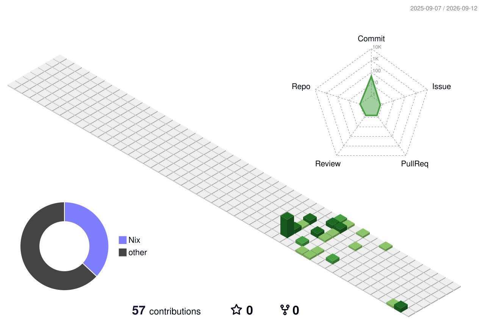

<h1>I'm Johnathan Radojevich 👋 I model physical systems across time and space, all the way down to risk.</h1>
<!-- Scientific Computing -->
<picture>
    <source media="(prefers-color-scheme: light)" srcset="https://img.shields.io/badge/-Python-000000?style=flat-square&logo=python">
    <source media="(prefers-color-scheme: dark)" srcset="https://img.shields.io/badge/-Python-0e1117?style=flat-square&logo=python">
    
</picture>
<picture>
    <source media="(prefers-color-scheme: light)" srcset="https://img.shields.io/badge/-Julia-000000?style=flat-square&logo=julia">
    <source media="(prefers-color-scheme: dark)" srcset="https://img.shields.io/badge/-Julia-0e1117?style=flat-square&logo=julia">
    
</picture>
<picture>
    <source media="(prefers-color-scheme: light)" srcset="https://img.shields.io/badge/-R-000000?style=flat-square&logo=r">
    <source media="(prefers-color-scheme: dark)" srcset="https://img.shields.io/badge/-R-0e1117?style=flat-square&logo=r">
    
</picture>
<picture>
    <source media="(prefers-color-scheme: light)" srcset="https://img.shields.io/badge/-Numpy-000000?style=flat-square&logo=numpy">
    <source media="(prefers-color-scheme: dark)" srcset="https://img.shields.io/badge/-Numpy-0e1117?style=flat-square&logo=numpy">
    
</picture>
<picture>
    <source media="(prefers-color-scheme: light)" srcset="https://img.shields.io/badge/-SciPy-000000?style=flat-square&logo=scipy">
    <source media="(prefers-color-scheme: dark)" srcset="https://img.shields.io/badge/-SciPy-0e1117?style=flat-square&logo=scipy">
    
</picture>
<picture>
    <source media="(prefers-color-scheme: light)" srcset="https://img.shields.io/badge/-Pandas-000000?style=flat-square&logo=pandas">
    <source media="(prefers-color-scheme: dark)" srcset="https://img.shields.io/badge/-Pandas-0e1117?style=flat-square&logo=pandas">
    
</picture>
<!-- Web & Application -->
<picture>
    <source media="(prefers-color-scheme: light)" srcset="https://img.shields.io/badge/-TypeScript-000000?style=flat-square&logo=typescript">
    <source media="(prefers-color-scheme: dark)" srcset="https://img.shields.io/badge/-TypeScript-0e1117?style=flat-square&logo=typescript">
    
</picture>
<picture>
    <source media="(prefers-color-scheme: light)" srcset="https://img.shields.io/badge/-JavaScript-000000?style=flat-square&logo=javascript">
    <source media="(prefers-color-scheme: dark)" srcset="https://img.shields.io/badge/-JavaScript-0e1117?style=flat-square&logo=javascript">
    
</picture>
<picture>
    <source media="(prefers-color-scheme: light)" srcset="https://img.shields.io/badge/-HTML-000000?style=flat-square&logo=htmx">
    <source media="(prefers-color-scheme: dark)" srcset="https://img.shields.io/badge/-HTML-0e1117?style=flat-square&logo=htmx">
    
</picture>
<picture>
    <source media="(prefers-color-scheme: light)" srcset="https://img.shields.io/badge/-CSS-000000?style=flat-square&logo=css">
    <source media="(prefers-color-scheme: dark)" srcset="https://img.shields.io/badge/-CSS-0e1117?style=flat-square&logo=css">
    
</picture>
<picture>
    <source media="(prefers-color-scheme: light)" srcset="https://img.shields.io/badge/-Golang-000000?style=flat-square&logo=go">
    <source media="(prefers-color-scheme: dark)" srcset="https://img.shields.io/badge/-Golang-0e1117?style=flat-square&logo=go">
    
</picture>
<picture>
    <source media="(prefers-color-scheme: light)" srcset="https://img.shields.io/badge/-Java-000000?style=flat-square&logo=coffeescript">
    <source media="(prefers-color-scheme: dark)" srcset="https://img.shields.io/badge/-Java-0e1117?style=flat-square&logo=coffeescript">
    
</picture>
<!-- Infrastructure -->
<picture>
    <source media="(prefers-color-scheme: light)" srcset="https://img.shields.io/badge/-PostgreSQL-000000?style=flat-square&logo=postgresql">
    <source media="(prefers-color-scheme: dark)" srcset="https://img.shields.io/badge/-PostgreSQL-0e1117?style=flat-square&logo=postgresql">
    
</picture>
<picture>
    <source media="(prefers-color-scheme: light)" srcset="https://img.shields.io/badge/-Redis-000000?style=flat-square&logo=redis">
    <source media="(prefers-color-scheme: dark)" srcset="https://img.shields.io/badge/-Redis-0e1117?style=flat-square&logo=redis">
    
</picture>
<picture>
    <source media="(prefers-color-scheme: light)" srcset="https://img.shields.io/badge/-Kafka-000000?style=flat-square&logo=apachekafka">
    <source media="(prefers-color-scheme: dark)" srcset="https://img.shields.io/badge/-Kafka-0e1117?style=flat-square&logo=apachekafka">
    
</picture>
<picture>
    <source media="(prefers-color-scheme: light)" srcset="https://img.shields.io/badge/-Kubernetes-000000?style=flat-square&logo=kubernetes">
    <source media="(prefers-color-scheme: dark)" srcset="https://img.shields.io/badge/-Kubernetes-0e1117?style=flat-square&logo=kubernetes">
    
</picture>
<picture>
    <source media="(prefers-color-scheme: light)" srcset="https://img.shields.io/badge/-Terraform-000000?style=flat-square&logo=terraform">
    <source media="(prefers-color-scheme: dark)" srcset="https://img.shields.io/badge/-Terraform-0e1117?style=flat-square&logo=terraform">
    
</picture>
<picture>
    <source media="(prefers-color-scheme: light)" srcset="https://img.shields.io/badge/-AWS-000000?style=flat-square&logo=icloud">
    <source media="(prefers-color-scheme: dark)" srcset="https://img.shields.io/badge/-AWS-0e1117?style=flat-square&logo=icloud">
    
</picture>
<picture>
    <source media="(prefers-color-scheme: light)" srcset="https://img.shields.io/badge/-Azure-000000?style=flat-square&logo=icloud">
    <source media="(prefers-color-scheme: dark)" srcset="https://img.shields.io/badge/-Azure-0e1117?style=flat-square&logo=icloud">
    
</picture>
<!-- Environment -->
<picture>
    <source media="(prefers-color-scheme: light)" srcset="https://img.shields.io/badge/-Nix-000000?style=flat-square&logo=nixos">
    <source media="(prefers-color-scheme: dark)" srcset="https://img.shields.io/badge/-Nix-0e1117?style=flat-square&logo=nixos">
    
</picture>
<picture>
    <source media="(prefers-color-scheme: light)" srcset="https://img.shields.io/badge/-NixOS-000000?style=flat-square&logo=nixos">
    <source media="(prefers-color-scheme: dark)" srcset="https://img.shields.io/badge/-NixOS-0e1117?style=flat-square&logo=nixos">
    
</picture>
<picture>
    <source media="(prefers-color-scheme: light)" srcset="https://img.shields.io/badge/-Linux-000000?style=flat-square&logo=linux">
    <source media="(prefers-color-scheme: dark)" srcset="https://img.shields.io/badge/-Linux-0e1117?style=flat-square&logo=linux">
    
</picture>
<picture>
    <source media="(prefers-color-scheme: light)" srcset="https://img.shields.io/badge/-MacOS-000000?style=flat-square&logo=apple">
    <source media="(prefers-color-scheme: dark)" srcset="https://img.shields.io/badge/-MacOS-0e1117?style=flat-square&logo=apple">
    
</picture>
<picture>
    <source media="(prefers-color-scheme: light)" srcset="https://img.shields.io/badge/-Vim-000000?style=flat-square&logo=vim">
    <source media="(prefers-color-scheme: dark)" srcset="https://img.shields.io/badge/-Vim-0e1117?style=flat-square&logo=vim">
    
</picture>

<picture>
    <source media="(prefers-color-scheme: dark)" srcset="./profile-3d-contrib/profile-night-rainbow.svg">
    <source media="(prefers-color-scheme: light)" srcset="./profile-3d-contrib/profile-green-animate.svg">
    
</picture>
<h3>💼 Software Engineer</h3>
<blockquote>
Shipping software to millions of users taught me that the hardest part is never the code it’s the model of the problem. That realization eventually pulled me toward domains where the model <em>is</em> the point: climate, epidemics, physical systems that don’t wait for a hotfix.
</blockquote>

    Over five years in production engineering, I’ve designed and shipped systems used by millions of people and processed over $7 billion in revenue. The work spans full-stack web applications, distributed systems, and the data infrastructure behind them in whatever language the problem calls for. I’m also a certified Scrum Master, Product Owner, and Developer.

<h3>👨‍🎓 Computational Modeling of Spatiotemporal Systems</h3>

    The systems I care most about can’t be reasoned about at a single point in space or time. Disease doesn’t spread <em>at</em> a location it propagates across a geography. Temperature doesn’t change <em>at</em> a sensor it evolves across a field. The model has to be spatiotemporal, or it’s missing the phenomenon entirely.

    Infectious disease pulled me in hardest. Transmission is a dynamic spatial process: pathogens move through populations shaped by climate, terrain, and human mobility and the difference between a contained outbreak and a pandemic is often a question of where and when, not just whether. Capturing that requires both the mathematical depth to describe wave-like propagation and the spatial literacy to anchor it in real geography.

    I’m building toward this through a deliberate sequence of graduate programs:

<table>
    <thead>
        <tr><th>Stage</th><th>Program</th><th>Institution</th></tr>
    </thead>
    <tbody>
        <tr>
            <td>Computational Background</td>
            <td>M.S. Computer Science <em>(Computing Systems)</em></td>
            <td>Georgia Tech</td>
        </tr>
        <tr>
            <td>Mathematical Background</td>
            <td>M.S. Applied &amp; Computational Mathematics</td>
            <td>University of Washington</td>
        </tr>
        <tr>
            <td>Spatial Computation</td>
            <td>M.S. CyberGIS &amp; Geospatial Data Science</td>
            <td>University of Illinois Urbana-Champaign</td>
        </tr>
    </tbody>
</table>

    From this foundation, I plan to specialize in one or more applied domains epidemiology, meteorology, or climate risk depending on where the research leads. The sequencing is deliberate: computational depth first, mathematical rigor second, spatial grounding third.

    I’ve also begun building <a href="https://acidex.com">Acidex</a> - an infrastructure layer for digestive health applications grounded in chemistry and physiology, not just symptom tracking.

<picture>
    <source media="(prefers-color-scheme: light)" srcset="logo_light.png">
    <source media="(prefers-color-scheme: dark)"  srcset="logo_dark.png">
    
</picture>
<h3>❄️ Nix Enthusiast</h3>

    Nix is the only package manager I’ve used that takes reproducibility seriously as a design goal rather than a feature. Immutable derivations, referential transparency, deterministic builds these aren’t niceties, they’re what it actually means to know what software you’re running. That matters everywhere, but it matters most in biological and healthcare computing, where long-lived pipelines and heterogeneous toolchains make "works on my machine" a genuine research liability. A result you can’t reproduce isn’t a result.

    My personal setup uses MacOS as the host for graphical applications (Safari, Calendar, iMessage) with NixOS in a VM handling almost everything development-related editor, compilation, tooling. If you’d like to check out the configuration, it’s <a href="https://github.com/johnathan-radojevich/nome">here.</a>

